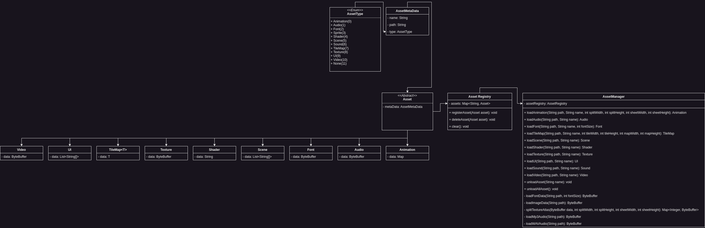

Every game engine and game depends heavily on assets or resources that it can display. Because of this the asset manager
is an integral part of Infernal.

## Asset Registry

Because we will need to load multiple tenth or hundreds of assets we need some kind of asset registry where we can
register all the assets we need and can easily find them.

## Assets

Every asset in Infernal has a certain type and metadata to define the asset.

### Asset Types

- Texture
- Font
- Audio
- Animation
- Shader
- TileMap
- Ui
- Video
- Scene
- None

### Asset Meta Data

- Name
- Path to file
- Asset Type

With this it is possible to create assets for each use case and every type of asset we could possibly have to deal with
in Infernal. Because Infernal is a 2D game engine we support only assets that fit this specific genre.

## Supported File Types

Because this is a necessary and common question for most developers here is a list of file types Infernal supports for
each type of asset. This list may change in later versions of Infernal, but we can assure you it will only grow and not
get smaller, so we won't drop support for anything.

- Animation:
    - .bmp
    - .png
    - .jpeg
    - .gif
    - .tga
    - .ase
    - .aseprite
- Audio:
    - .mp3
    - .wav
- Fonts:
    - .ttf
- Tile Maps:
    - .json
- Scenes:
    - .json
    - .csv
- Shaders:
    - .vert
    - .frag
    - .geom
    - .tesc
    - .tese
    - .comp
- Textures:
    - .bmp
    - .png
    - .jpeg
    - .gif
    - .tga
- UI:
    - .json
- Sound:
    - .mp3
    - .wav
- Video:
    - .mp4

## Architecture

