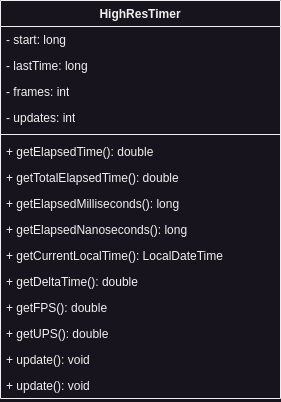

Because many operations in games and game engines are based on time or a certain elapsed time, Infernal has its own
high resolution timer implemented. This class handles all time based operations that are most common:

- Delta Time calculation
- Elapsed Time calculation
- Milliseconds
- Nanoseconds
- Current local time
- FPS calculation
- UPS calculation
- Time in different formats

This takes the think work out of time usage for game developers, because they can just use the high resolution timer and
forget about own calculations.

## Architecture

