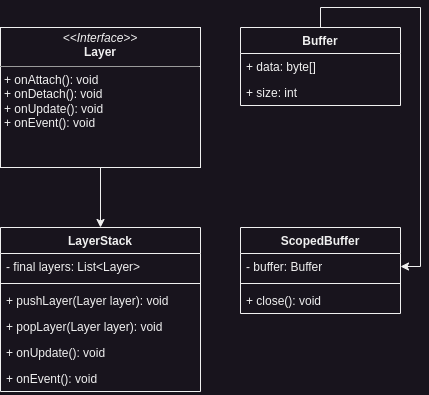

Infernal implements some primitive data types that are not existent in Java but are needed for certain processes. Those are data structures that might be derived from or are directly used. For now Infernal implements:

- Buffer
- Scoped Buffer
- Layer
- Layer Stack

It is possible that some might be added later on in the development process if needed. The good thing is that in case of Java some data types that would have been self implementations by Infernal, if it was build in C++, are implemented in Java by default so this takes out some work.

## Architecture
