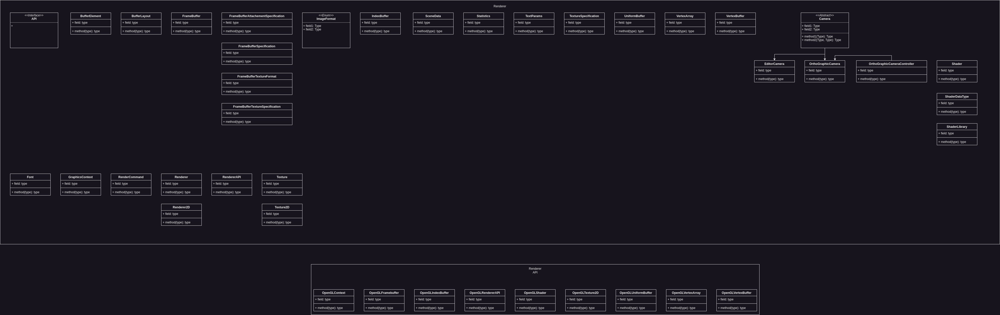

In the current versions of Infernal rendering is handled via OpenGL. This allows us to be simple and easy to understand but also be cross platform. For now this is sufficient but it might be that Vulkan is added at a later state of Infernal's development.

We split the architecture into two parts, the rendering API and the renderer. The line we draw, is by no means a best practice or the only way this could be implemented, it is a line that we draw because it gives us the necessary control and we feel good about this split.

Basically we split the architecture like this:

**Renderer (platform agnostic)**
- 2D Renderer
- Scene Graph
- Sorting
- Culling
- Materials
- LOD
- Animation
- Camera
- VFX
- PostFX
- Swap Chain
- Pipelines
- Render Passes
- Font
- Render Command
- Batching
- Scene Graph

**Renderer API (platform specific)**
- Render Context
- Frame Buffer
- Vertex Buffer
- Index Buffer
- Uniform Buffer
- Texture
- Shader
- States

Going with this approach makes Infernal more flexible but also add's a lot of time to initial development because this needs to be really nailed down.

## Architecture
