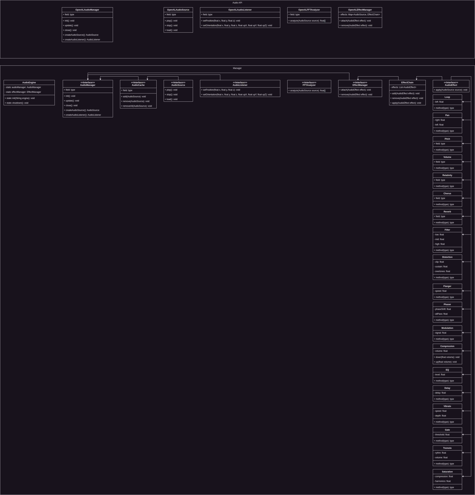

Audio is a big part of games nowadays, it is just not enough to play some tunes and hope to catch the player's
attention. Because of this Infernal is designed to have an audio implementation that allows more control for the
developer that engines like game maker allow.

Because we want to enable developers to really fine tune music and sound effects for their games we implemented audio
playback and controls but also a big pallet of audio effects that you can use to tweak your sounds and music. This
almost enable you to work in the audio module like you would do in a DAW. But let's keep it real, Infernal will never
replace a good DAW it will only support you with more tools inside the engine.

## Effects

- Looping
- Pan
- Pitch
- Volume
- Relativity
- Position
- Velocity
- Chorus
- Reverb
- Filters
- Distortion
- Flanger
- Phaser
- Modulation
- Compression
- EQ
- Delay
- Vibrato
- Gate
- Tremolo
- Saturation

Besides all of that we use the same approach as we did with the rendering engine and split the architecture into two
parts. This is necessary because for now OpenAL might be sufficient, but in later versions support for FMOD might come
in which will allow even more and other methods of working with audio.

**AudioManager (platform-agnostic)**

- AudioEngine
- Audio Source
- Audio Listener
- Audio Manager
- Audio Effect
- Effect Manager
- Effect Chain
- FFTAnalyzer
- Audio Cache

**Audio API (platform specific)**

- OpenALAudioSource
- OpenALAudioListener
- OpenALAudioManager
- OpenALAudioEffectManager
- OpenALFFTAnalyzer

## Architecture

