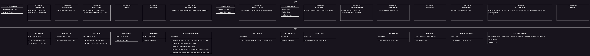

Physics is not the biggest part of games that we will typically develop with Infernal, that because 2D RPG's typically
don't rely heavily on physics. But we want to at least support a specific amount of physics, enough to enhance certain
game mechanics, but also for those that want to rely more on physics if they want.

We support Box2D for because it is sufficient for the 2D games we will commonly see developed with Infernal. In later
versions we might support other frameworks as well.

Like the rendering and audio system we will go for the split architecture with two sides here:

**Physics (platform-agnostic)**

- PhysicsWorld
- PhysicsFixture
- PhysicsBody
- Shape
- PhysicsJoint
- CollisionListener
- RayCastResult
- PhysicsRaycast
- PhysicsMaterial
- PhysicsQuery
- Simulation Callback
- PhysicsDebug
- Fluid

**Physics API (platform specific)**

- Box2DWorld
- Box2DBody
- Box2DFixture
- Box2DJoint
- Box2DCollisionListener
- Box2DRaycast
- Box2DPhysicsMaterial
- Box2DPhysicsQuery
- Box2DPhysicsFluid

Because we won't be relying heavily on physics in Infernal, we implemented only features we would typically see, so
there is no rag-doll effect or advanced forces here.

## Architecture

