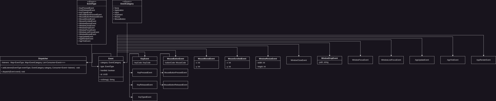

# Event System

The Infernal Engine incorporates its own Event System, a pragmatic solution serving three primary objectives:

**Decoupling & Modularity:**

The inclusion of an event system in Infernal facilitates communication between different modules and systems without
establishing tight dependencies. This design choice enhances the modularity of the codebase by allowing components to
operate independently. The resulting code modularity simplifies development, making it easier to understand and
maintain. Additionally, this decoupling enables the introduction of new features or systems without requiring extensive
refactoring.

**Flexibility & Extensibility:**

Infernal's Event System is crafted to offer flexibility and extensibility. Events, as key components, empower the
architecture to adapt to evolving requirements. The system's flexibility becomes apparent when incorporating new systems
or features, as it enables their seamless integration without major disruptions to existing code. Engine components can
respond to events without intricate knowledge of other components, promoting independence and simplifying the addition
of innovative features.

**Asynchronous Communication:**

The Event System in Infernal supports asynchronous communication, a practical feature for creating dynamic and
responsive gameplay. Events, when triggered, allow various engine components to react independently and concurrently.
This asynchronous communication contributes to efficient and fluid gameplay, ensuring that different aspects of the game
can operate in parallel without compromising overall performance.

In summary, the Event System in Infernal is a pragmatic addition, addressing fundamental principles of code
organization, flexibility, and efficient communication between engine components. Its implementation aligns with our
commitment to providing a developer-friendly environment without compromising on adaptability and performance.

## How an Event System Works

### Event Definition

Events are defined as data structures or classes that carry information about a specific occurrence in the game. For
example, an input event might contain information about a key press, such as the key code and whether it was a press or
release.

### Event Dispatcher

The event system typically includes a dispatcher responsible for managing and sending events. When an event occurs (
e.g., a key press, collision), the relevant system or component dispatches the corresponding event to the event system.

### Event Subscription

Components interested in specific events can subscribe to the event system. This subscription allows them to be notified
when relevant events occur. Components can register callback functions or methods that should be invoked when a
particular event is dispatched.

### Event Handling

When an event is dispatched, the event system notifies all subscribed components. Each component's registered callback
is invoked, allowing it to react to the event. This mechanism ensures that different parts of the codebase can respond
to events without direct dependencies.

## Types of Events

1. Input Events:
    1. KeyPressedEvent:
    2. KeyReleasedEvent:
    3. KeyTypedEvent:
    4. MouseButtonPressedEvent:
    5. MouseButtonReleasedEvent:
    6. MouseMovedEvent:
    7. MouseScrolledEvent:
2. Window Events:
    1. WindowResizeEvent: Indicates a change in the size of the game window.
    2. WindowCloseEvent: Indicates that the user has requested to close the window.
    3. WindowDropEvent:
    4. WindowCloseEvent:
    5. WindowFocusEvent:
    6. WindowLostFocusEvent
    7. WindowMovedEvent:
3. Application Events:
    1. AppUpdateEvent: Indicates that the game is about to update.
    2. AppRenderEvent: Indicates that the game is about to render.
    3. AppTickEvent:

## Event Categories:

1. None
2. Application
3. Input
4. Keyboard
5. Mouse
6. MouseButton

## Architecture
