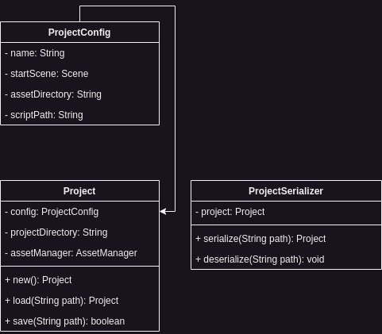

In Infernal, games are projects. This structure is needed to make it easier to develop new games. If you create a new project you will be setup with a start scene and some basic scaffolding for you, from this point on you can load in assets and develop mechanics.

Projects are stored in JSON files while developing, and if you want to ship your game it will be exported as executable binary.

## Architecture
