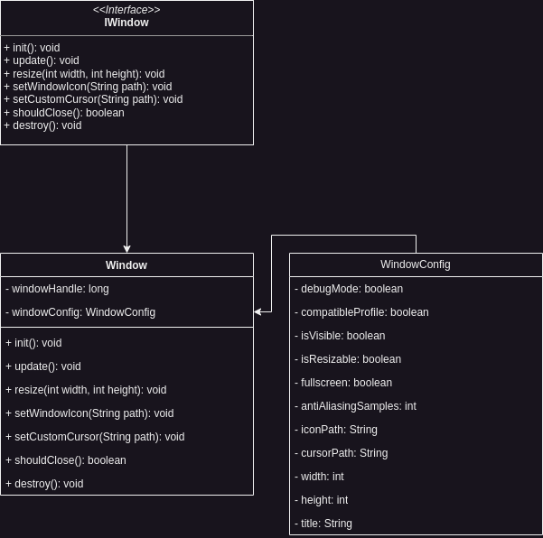

Infernal implements its own window abstraction with help of GLFW. This allows easier window creation with deterministic
behaviour instead of letting the devs shoulder this. The window will be initialized in the Entrypoint and will have a
lot of default configuration.

Like the Entrypoint it is possible for the Game Dev to manipulate the Window by configuring it. You have the following
parameters to set:

- ```Debug mode: boolean```
- ```Compatible Profile: boolean```
- ```Visibility: boolean```
- ```Resizability: boolean```
- ```Fullscreen: boolean```
- ```Anti Aliasing Samples: integer```
- ```Window Icon Path: String```
- ```Window Cursor Path: String```
- ```Window width: integer```
- ```Window height: integer```
- ```Window title: String```

## Architecture

