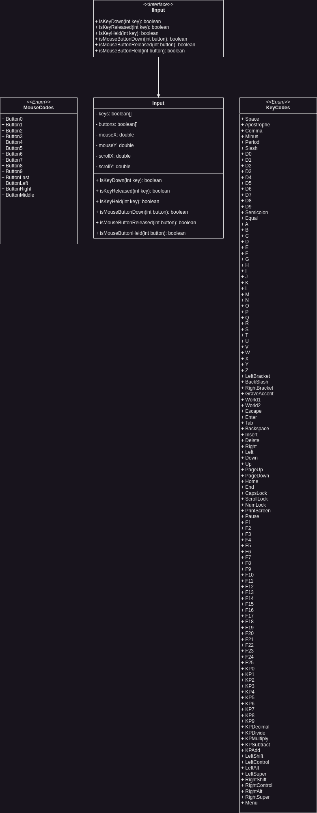

Infernal is able to take input from the user in form of keyboard and mouse input. That means it can handle all keys
pressed on a regular full size keyboard with macro keys and other stuff as well as every mouse key and mouse scroll
input.

To handle the input there is an Input Class that initializes with all the needed callbacks and then listens constantly
for key and mouse events. The user or game dev can write listeners himself for reaction on certain inputs, like shown in
the example below.

In addition, Infernal queues the Input to handle performance issues and make it easier to handle multiple button presses
at once.

```java
if(input.isKeyDown(int key)){ // Perform an action when the space key is pressed 
}

if(input.isKeyReleased(int key)){ // Perform an action when the enter key is released 
}

if(input.isKeyHeld(int key)){ // Perform an action when the enter key is released 
}

if(input.isMouseButtonDown(int button)){ // Perform an action when the left mouse button is held down 
}

if(input.isMouseButtonReleased(int button)){ // Perform an action when the left mouse button is held down 
}

if(input.isMouseButtonHeld(int button)){ // Perform an action when the left mouse button is held down 
}
```

You can also get the mouse position and the scroll distance via get methods.

## Key Codes

- KeyCodes.Space
- KeyCodes.Apostrophe
- KeyCodes.Comma
- KeyCodes.Minus
- KeyCodes.Period
- KeyCodes.Slash
- KeyCodes.D0
- KeyCodes.D1
- KeyCodes.D2
- KeyCodes.D3
- KeyCodes.D4
- KeyCodes.D5
- KeyCodes.D6
- KeyCodes.D7
- KeyCodes.D8
- KeyCodes.D9
- KeyCodes.Semicolon
- KeyCodes.Equal
- KeyCodes.A
- KeyCodes.B
- KeyCodes.C
- KeyCodes.D
- KeyCodes.E
- KeyCodes.F
- KeyCodes.G
- KeyCodes.H
- KeyCodes.I
- KeyCodes.J
- KeyCodes.K
- KeyCodes.L
- KeyCodes.M
- KeyCodes.N
- KeyCodes.O
- KeyCodes.P
- KeyCodes.Q
- KeyCodes.R
- KeyCodes.S
- KeyCodes.T
- KeyCodes.U
- KeyCodes.V
- KeyCodes.W
- KeyCodes.X
- KeyCodes.Y
- KeyCodes.Z
- KeyCodes.LeftBracket
- KeyCodes.Backslash
- KeyCodes.RightBracket
- KeyCodes.GraveAccent
- KeyCodes.World1
- KeyCodes.World2
- KeyCodes.Escape
- KeyCodes.Enter
- KeyCodes.Tab
- KeyCodes.Backspace
- KeyCodes.Insert
- KeyCodes.Delete
- KeyCodes.Right
- KeyCodes.Left
- KeyCodes.Down
- KeyCodes.Up
- KeyCodes.PageUp
- KeyCodes.PageDown
- KeyCodes.Home
- KeyCodes.End
- KeyCodes.CapsLock
- KeyCodes.ScrollLock
- KeyCodes.NumLock
- KeyCodes.PrintScreen
- KeyCodes.Pause
- KeyCodes.F1
- KeyCodes.F2
- KeyCodes.F3
- KeyCodes.F4
- KeyCodes.F5
- KeyCodes.F6
- KeyCodes.F7
- KeyCodes.F8
- KeyCodes.F9
- KeyCodes.F10
- KeyCodes.F11
- KeyCodes.F12
- KeyCodes.F13
- KeyCodes.F14
- KeyCodes.F15
- KeyCodes.F16
- KeyCodes.F17
- KeyCodes.F18
- KeyCodes.F19
- KeyCodes.F20
- KeyCodes.F21
- KeyCodes.F22
- KeyCodes.F23
- KeyCodes.F24
- KeyCodes.F25
- KeyCodes.KP0
- KeyCodes.KP1
- KeyCodes.KP2
- KeyCodes.KP3
- KeyCodes.KP4
- KeyCodes.KP5
- KeyCodes.KP6
- KeyCodes.KP7
- KeyCodes.KP8
- KeyCodes.KP9
- KeyCodes.KPDecimal
- KeyCodes.KPDivide
- KeyCodes.KPMultiply
- KeyCodes.KPSubtract
- KeyCodes.KPAdd
- KeyCodes.KPEnter
- KeyCodes.KPEqual
- KeyCodes.LeftShift
- KeyCodes.LeftControl
- KeyCodes.LeftAlt
- KeyCodes.LeftSuper
- KeyCodes.RightShift
- KeyCodes.RightControl
- KeyCodes.RightAlt
- KeyCodes.RightSuper
- KeyCodes.Menu

## Mouse Codes

- MouseCodes.Button0
- MouseCodes.Button1
- MouseCodes.Button2
- MouseCodes.Button3
- MouseCodes.Button4
- MouseCodes.Button5
- MouseCodes.Button6
- MouseCodes.Button7
- MouseCodes.ButtonLast
- MouseCodes.ButtonLeft
- MouseCodes.ButtonRight
- MouseCodes.ButtonMiddle

## Architecture

