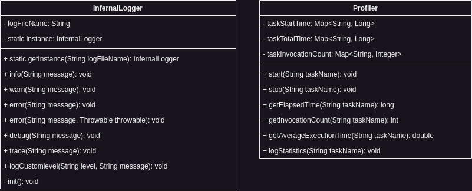

Infernal's Debug system consists of two parts, firstly a good logger to enable good debug messages and output and
secondly a profiler that can be both visually and textually helpful for the developer.

## Logger

The logger helps developers to read where a certain problem might by waiting for them, as well as allowing developers to
log their own messages either to the console or to a file if needed. If you log to a file the logger will always append
new log entries to the file and initially create a new file if it does not exist.

### Log Levels

- Info
- Warning
- Error
- Debug
- Trace
- Custom

### Log Format

For now there is a set default format for all logs that can be written by the logger. The format looks
like: `{date} [{thread}] {level}: {message}`. *In a later version of Infernal it might be possible to set your own
custom format*.

## Profiler

Infernal's profiler enables developers to see where the performance heavy tasks are waiting and where they might improve
their implementations with their games. For this the profiler takes two metrics as measurements into account, the *
*total time a task takes** and the **invocation count of a task**. If the profiler is running it will constantly log the
statistics to a file for you to read after a profiling session.

### Is Infernal profiled ?

Yes Infernal is profiled itself, if you want to see what part of the engine takes what time, you can enable the debug
mode and the profiler flags in the code will be active from that point on.

## Architecture

