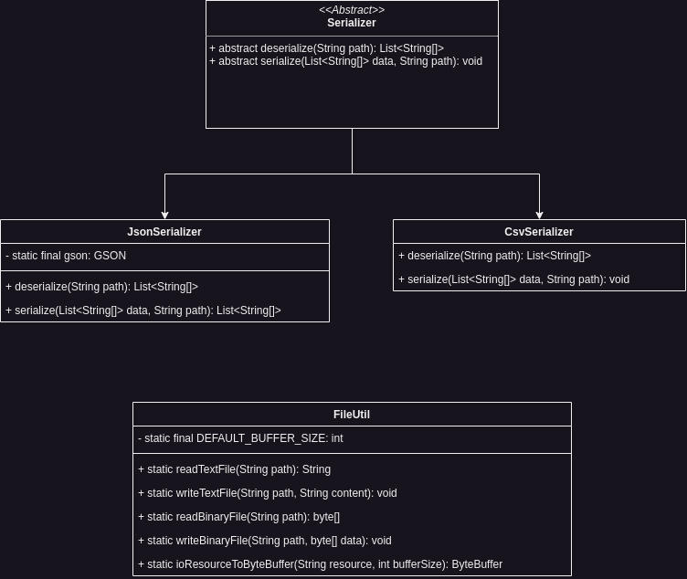

Because game engines are data heavy applications Infernal comes with it's own set of file serialization operations. In it's base every serializer that is implemented in Infernal has a serialization and deserialization method that are doing what is necessary to read and write files in the most performant way possible.

Currently there are two serializers implemented, the CSV serializer and the JSON serializer.

In addition to the serializers we have a set of utilities that might come in handy for different file related tasks:
- read text files (any)
- write text files (any)
- read binary files (any)
- write binary files (any)
- IO Resource to Byte Buffer

More specialized reading and writing of files can be found in the asset manager section.

## Architecture
