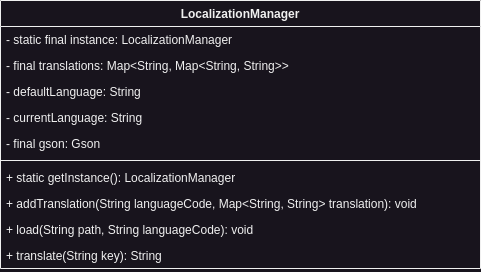

Because we live in a multilingual world it is important to provide game developers with the possibility to localize their games easily and enable them to serve multiple languages with the smallest amount of work possible.

The localization module of Infernal enables game developers to load translation files in style of i18n (Web Library), so basically a key value based JSON file that can be implemented in different languages. The localization manager will read those files and can switch the value based of the key if needed. How many languages will be provided and how the localization manager will be implemented in the final games is based on the developers then.

In addition to the translation you can also choose a default language that the localization manager should load, we set this to english because we think most games will fit this quite well.

## Language Codes
There are a few standards for language codes out there, this is quite irrelevant in our case, but if you choose one please stick to it because it is relevant for the file naming. Check out the examples below:

```java
language code = "en" => en.json
language code = "eng" => eng.json
```

The most common standards are the **ISO 639-2** and the **ISO 639-1**. Check out the [wiki article](https://en.wikipedia.org/wiki/List_of_ISO_639-1_codes) if you want to learn more and look up your language code in the specified ISO definition.

## Architecture
